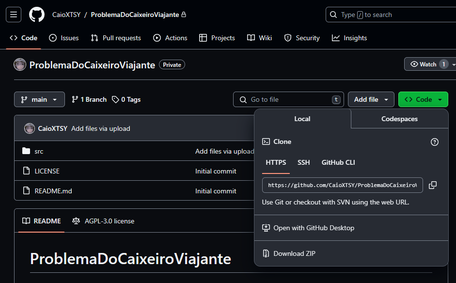
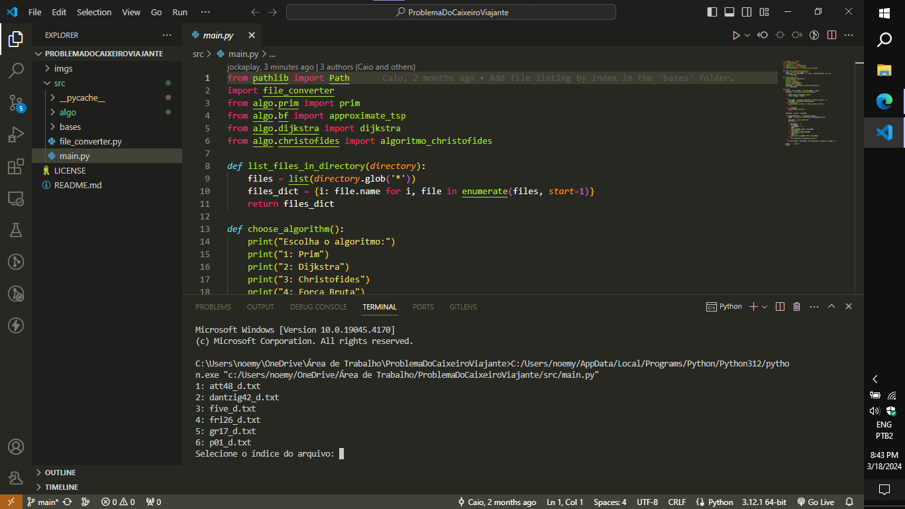
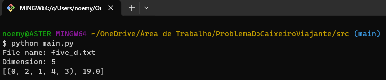

# TSP - O Problema do Caixeiro-Viajante

O __Problema do Caixeiro-Viajante__ (__PCV__) é um problema que tenta determinar a menor rota para percorrer uma série de cidades (visitando uma única vez cada uma delas), retornando à cidade de origem.[¹](https://pt.wikipedia.org/wiki/Problema_do_caixeiro-viajante)

Neste projeto será feito uma simulação deste problema a partir das bases de dados, __ATT48__, __DANTZIG42__, __FRI26__, __GR17__ e __P01__, fornecidas em [TSP Data for the Traveling Salesperson Problem](https://people.sc.fsu.edu/~jburkardt/datasets/tsp/tsp.html?authuser=2).

---
### Instalação

Nesta seção serão fornecidas intruções de como instalar este projeto em seu computador.

1. Clique em __<> Code__ e então, clone este repositório (caso tenha git) ou faça o download do repositório como ZIP*.

    

__*:__ Faça a extração da pasta em seu computador

2. O projeto já está instalado 

__OBS:__ Caso não tenha o Python instalado em seu computador, você poderá fazer o download [aqui](https://www.python.org/downloads/) ou pela Microsft Store, nos Windows 10 e 11.

---
### Como Usar

Nesta seção serão fornecidas instruções de como usar este projeto.

__VS Code__

1. Abra o __VS Code__ e em seguida abra a pasta do repositório

2. Na pasta do repositório, clique em __src__ e então no arquivo __main.py__

3. Rode o programa (Obs: Você deve ter o Python instalado, assim como extensões para o mesmo)

4. Forneça o nome do arquivo que você quer utilizar, como de exemplo, o arquivo five_d.txt (inclua a extensão)

5. Forneça a quantidade de cidades (o número de cidades pode ser encontrado no link fornecido na seção introdutória)

6. O resultado será apresentado depois de um tempo

    

__Terminal__

1. Abra o Terminal/PowerShell/Command Prompt

2. Navegue até a pasta com o código __main.py__ e então, digite __python main.py__

3. Forneça o nome do arquivo que você quer utilizar, como de exemplo, o arquivo five_d.txt (inclua a extensão)

4. Forneça a quantidade de cidades (o número de cidades pode ser encontrado no link fornecido na seção introdutória)

5. O resultado será apresentado depois de um tempo

    

---
### Licença

__Projeto:__  
Este projeto está licenciado sob a [GNU Affero General Public License v3.0
](https://www.gnu.org/licenses/agpl-3.0.en.html)

__Datasets:__  
Os datasets estão licenciados sob a [GNU Lesser General Public License](https://www.gnu.org/licenses/lgpl-3.0.en.html)

---
### Contato dos Desenvolvedores

Caio Teixeira - caio.teixeira@arapiraca.ufal.br  

Jockson Mateus - jockson.duarte@arapiraca.ufal.br  

Noemy Torres - noemy.pereira@arapiraca.ufal.br

---
### Hardware Sugerido(s)

- Processador Intel Core i3-6006U 2.0GHz, com 8GB de memória DDR4 (2x4 GB, 1333MHz), HD 500GB e sistema operacional Windows 10 Home Single Language;

- Processador Intel Core i5-9300H 2.4GHz~4.2GHz, com 16GB de memória DDR4 (2x8 GB, 2666MHz), 256GB SSD NVMe e sistema operacional Windows 11.

__OBS:__ Para realizar as simulações com datasets que possuem um valor alto de dados, é necessário uma máquina mais potente, como por exemplo, um modelo de computador SGI Rackable Standard-Depth Servers, com 56 núcleos em 2 soquetes de 2,00 GHz Intel (R) Xeon (R) CPU E5-2660 v4,1352 MHz 256 GB de memória DDR3 (32 × 8 GB) e sistema operacional Linux.

---
### Software Necessário

Todo o projeto está rodando no sistema operacional Windows/Linux, é necessário também ter o Python instalado em sua máquina.

__Não obrigatório:__ Git, VS Code.

---
### Informações Extras

Este projeto está sendo desenvolvido como requisito de nota para a disciplina de __Teoria dos Grafos__, ministrada pela professora __Raquel Cabral__, no 4º período do curso de __Ciências da Computação__ pela __UFAL Campus Arapiraca__. 